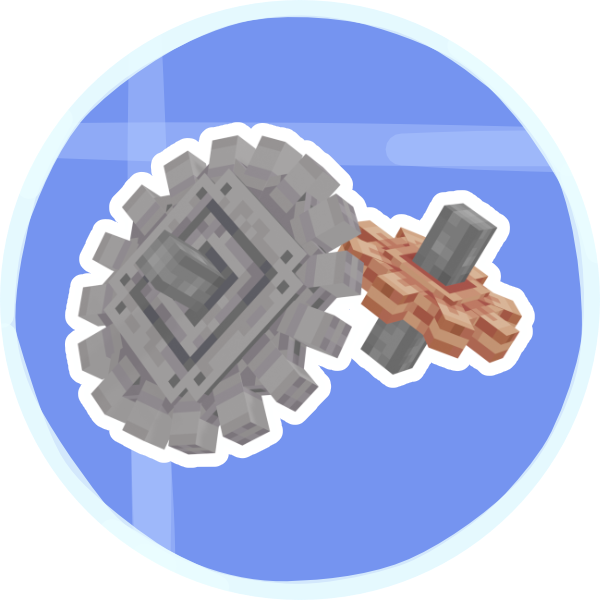

<h1 align="center">Extended Cogwheels (Multiloader)  

<p align="center">
    
</p>

<a href="https://www.curseforge.com/minecraft/mc-mods/create/files"></a>
<a href="https://www.curseforge.com/minecraft/mc-mods/create-extended-cogs"></a>
<a href="https://www.curseforge.com/minecraft/mc-mods/create-extended-cogwheels-fabric"></a>
<a href="https://github.com/Creators-of-Create/Create/blob/master/LICENSE"></a>
<a href="https://discord.gg/GJsQadv9Mc"></a>

</h1>

<p align="center">
[Forge & Fabric, 1.18.2, 1.19.2 & 1.20.1] Adding more cogwheels to the create mod aswell as providing progression systems to modpack developers through configurations
</p>

<br />

<hr/>

### Datapack Integration

(In Beta Testing) you are able to add new cogwheel materials through datapacks. You can find a guide on how to set up a datapack on the [Minecraft Wiki](https://minecraft.fandom.com/wiki/Tutorials/Creating_a_data_pack). Once you have that set up under your namespace directory create a new directory called `cogwheels` which you can then add new materials to following this schema:

```js
{
  // The ingredients are what the player can use on a cogwheel
  // to get your new material. You can use both items and tags
  // and specify as many as you like.
  "items": [
    {
      "tag": "some_mod:some_tag"
    },
    {
      "item": "some_mod:some_item"
    }
  ],
  // Here you can specify overwrites to the block models textures
  // put the resource location of one of your models current
  // textures under old and specify the new texture's location in
  // replacement. You can set as many of these as you need.
  "textures": [
    {
      "old": "create:small_cogwheel",
      "replacement": "some_mod:new_texture"
    }
  ],
  // Unless you need to replace the model, for example for brass
  // and copper cogwheels you do not need to specify the models
  // and they will default to the "vanilla" cogwheel models
  "small_model": "create:cogwheel_shaftless",
  "large_model": "create:large_cogwheel_shaftless",
  // These limits will only be applied if limits are enabled in
  // config. If you do not specify these fields they will default
  "speed_limit": 128, // Defaults to the speed limit set in config 
  "stress_limit": 2048 // Defaults to 2^31 (no limit)
}
```

And that's it you can now use your new cogwheels. If you want to add custom assets you can include them in KubeJS or a Resource Pack.

---

### KubeJS Integration (Deprecated)
KubeJS support has been deprecated please use datapacks to add new cogwheels

As of version 2.1 and above extended cogwheels has allows for you to create your own custom cogwheels easily with KubeJS (when both mods are present)

Cogwheels can now be created like any other block just specify the type and properties give it a texture and try it out in game

Example Adding A Small Cogwheel (Relevant texture files are placed in `/assets/kubjs/textures/block/example_cogwheel.png`)
```javascript
// startup_scripts/demo.js
onEvent('block.registry', event => {
	event.create('example_cogwheel', 'cogwheel')
	    .material('wood')
	    .displayName('Example Cogwheel');
})
```
Example Adding A Large Cogwheel
```javascript
// startup_scripts/demo.js
onEvent('block.registry', event => {
    event.create('large_example_cogwheel', 'large_cogwheel')
        .material('wood')
        .displayName('Example Cogwheel');
})
```

All Valid Variations Are `cogwheel`, `large_cogwheel`, `half_shaft_cogwheel`, `large_half_shaft_cogwheel`, `shaftless_cogwheel`, `large_shaftless_cogwheel` 

Existing builder methods for blocks are all supported for cogwheels. You can find some documentation for that here - https://wiki.latvian.dev/books/kubejs-legacy/page/custom-blocks